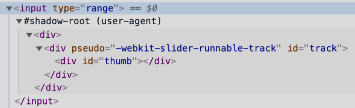
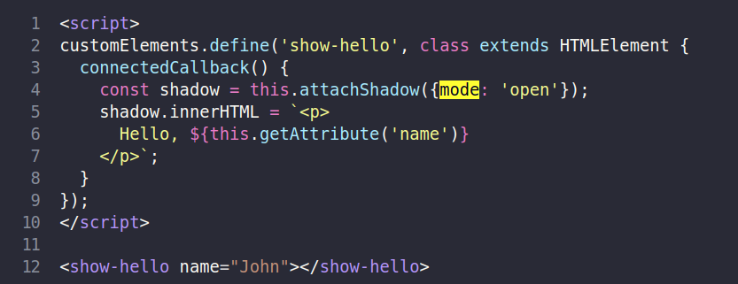

# Shadow DOM

* __Теневой DOM__ («Shadow DOM») используется для инкапсуляции. Благодаря ему в компоненте есть собственное «теневое» DOM-дерево, к которому нельзя просто так обратиться из главного документа, у него могут быть изолированные CSS-правила и т.д. (примеры: input, calendar)

* То, что находится под #shadow-root – и называется __«shadow DOM»__ (теневой DOM). Мы не можем получить доступ к теневому DOM встроенных элементов с помощью обычных JavaScript-вызовов или с помощью селекторов. Это не просто обычные потомки, это мощное средство инкапсуляции.

    

### Есть два ограничения:

  1. Для каждого элемента мы можем создать только один shadow root.
  
  2. В качестве elem может быть использован пользовательский элемент (Custom Element), либо один из следующих элементов: «article», «aside», «blockquote», «body», «div», «footer», «h1…h6», «header», «main», «nav», «p», «section» или «span». Остальные, например, , не могут содержать теневое дерево.
      

### Инкапсуляция

  1. Элементы теневого DOM не видны из обычного DOM через querySelector. В частности, элементы теневого DOM могут иметь такие же идентификаторы, как у элементов в обычном DOM (light DOM). Они должны быть уникальными только внутри теневого дерева.
  
  2. У теневого DOM свои стили. Стили из внешнего DOM не применятся.

  3. Стили главного документа не влияют на теневое дерево.

### *Итого*

  1. Теневой DOM – это способ создать свой, изолированный, DOM для компонента.

  2. shadowRoot = elem.attachShadow({mode: open|closed}) – создаёт теневой DOM для elem. Если mode="open", он доступен через свойство elem.shadowRoot.

  3. Мы можем создать подэлементы внутри shadowRoot с помощью innerHTML или других методов DOM.

  Элементы теневого DOM:
    * Обладают собственной областью видимости идентификаторов
    * Невидимы JavaScript селекторам из главного документа, таким как querySelector,
    * Стилизуются своими стилями из теневого дерева, не из главного документа.
